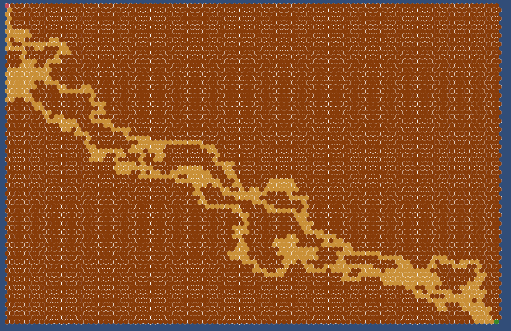

# Hexa Defense Dev Log

## Day 1

- **Ý tưởng**: Map tower defense với nhiều điểm bắt đầu và nhiều điểm kết thúc. Có thể đặt trụ trên đường đi/tường tuỳ loại trụ. Ô trên map sẽ là ô lục giác. Lưu data vẫn dùng mảng 2 chiều như bình thường nhưng cần linked đặc biệt hơn (1 ô -> 6 ô).
- Làm prefab cho tile.
- Script cho tile
- Script cho board
- Load map theo data tự dựng

Đã hiện được map theo file text có sẵn

## Day 2
- Tìm đường đi ngắn nhất có random 
    - Mapping giữa toạ độ ô hex và toạ độ lập phương: 
        - (0, 0) => (0, 0, 0)
        - (1, 0) => (1, 0, 1)
        - (2, 0) => (2, 0, 2)
        - (0, 1) => (1, 1, 0)
        - (1, 1) => (2, 1, 1)
        => (x, y) => (x + y, y, x);
- Debug: Click trái để thêm trụ, click phải để xoá ô (thành GROUND)
## Day 3
- Đặt trụ (real)
- Quái di chuyển
- Trụ bắn quái
- Quái tới đích thì biến mất

## Day X (TODO):
Công cụ soạn map: vẽ và "tô" để tạo ra map theo ý muốn